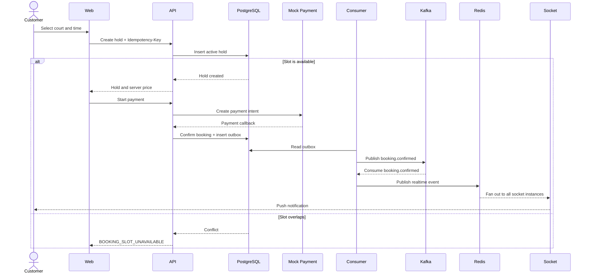
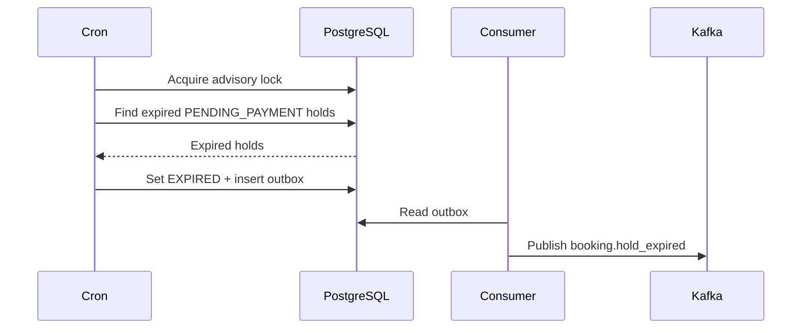
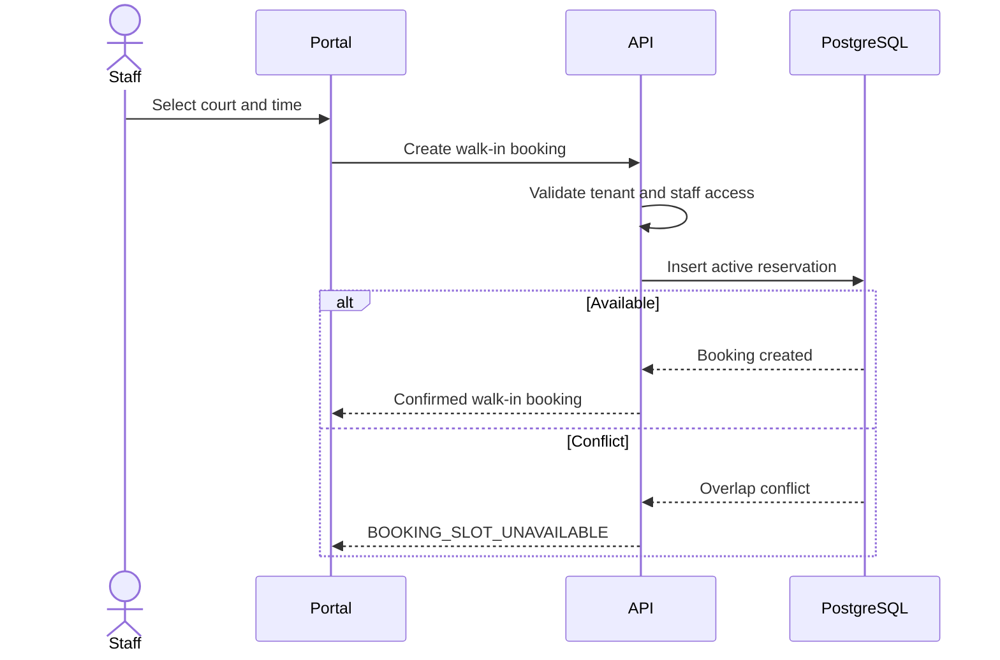
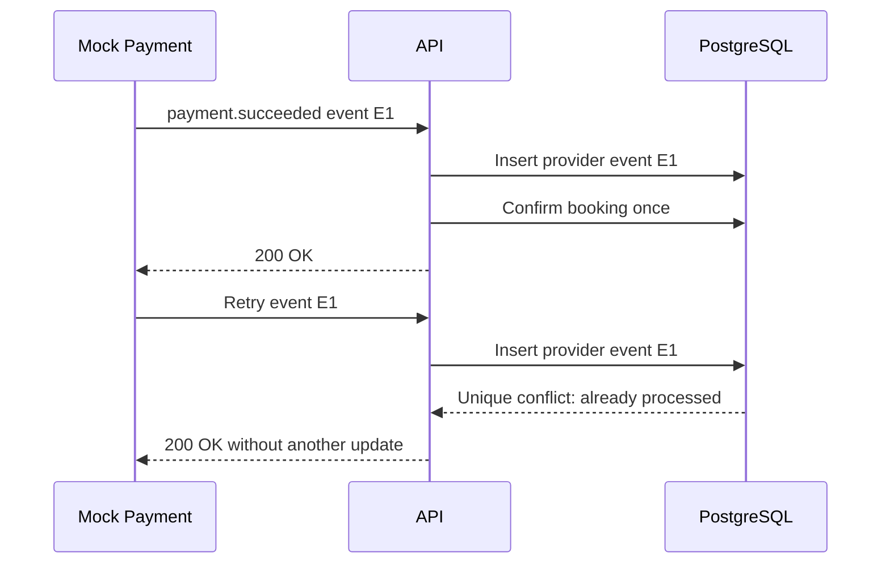

# Core Flow Diagrams

## Online Booking

```mermaid
sequenceDiagram
    actor Customer
    participant Web
    participant API
    participant DB as PostgreSQL
    participant Pay as Mock Payment
    participant Consumer
    participant Kafka
    participant Redis
    participant Socket

    Customer->>Web: Select court and time
    Web->>API: Create hold + Idempotency-Key
    API->>DB: Insert active hold
    alt Slot is available
        DB-->>API: Hold created
        API-->>Web: Hold and server price
        Web->>API: Start payment
        API->>Pay: Create payment intent
        Pay-->>API: Payment callback
        API->>DB: Confirm booking + insert outbox
        Consumer->>DB: Read outbox
        Consumer->>Kafka: Publish booking.confirmed
        Kafka-->>Consumer: Consume booking.confirmed
        Consumer->>Redis: Publish realtime event
        Redis-->>Socket: Fan out to all socket instances
        Socket-->>Customer: Push notification
    else Slot overlaps
        DB-->>API: Conflict
        API-->>Web: BOOKING_SLOT_UNAVAILABLE
    end
```

## Hold Expiration

```mermaid
sequenceDiagram
    participant Cron
    participant DB as PostgreSQL
    participant Consumer
    participant Kafka

    Cron->>DB: Acquire advisory lock
    Cron->>DB: Find expired PENDING_PAYMENT holds
    DB-->>Cron: Expired holds
    Cron->>DB: Set EXPIRED + insert outbox
    Consumer->>DB: Read outbox
    Consumer->>Kafka: Publish booking.hold_expired
```

## Walk-In Booking

```mermaid
sequenceDiagram
    actor Staff
    participant Portal
    participant API
    participant DB as PostgreSQL

    Staff->>Portal: Select court and time
    Portal->>API: Create walk-in booking
    API->>API: Validate tenant and staff access
    API->>DB: Insert active reservation
    alt Available
        DB-->>API: Booking created
        API-->>Portal: Confirmed walk-in booking
    else Conflict
        DB-->>API: Overlap conflict
        API-->>Portal: BOOKING_SLOT_UNAVAILABLE
    end
```

## Duplicate Payment Callback

```mermaid
sequenceDiagram
    participant Pay as Mock Payment
    participant API
    participant DB as PostgreSQL

    Pay->>API: payment.succeeded event E1
    API->>DB: Insert provider event E1
    API->>DB: Confirm booking once
    API-->>Pay: 200 OK
    Pay->>API: Retry event E1
    API->>DB: Insert provider event E1
    DB-->>API: Unique conflict: already processed
    API-->>Pay: 200 OK without another update
```
